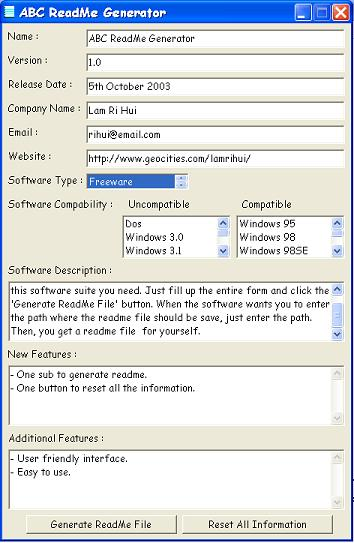



## ABC ReadMe Generator \(The Quickest, Easiest and Best ReadMe Generator Forever\)

### Description

Generate readme file by just filling up the form and click one button. Only 1 sub to generate the readme file. Quick and easy. Leave comments about this code. Also, don't forget to vote.
 
### More Info
 

             |
---                |---
**Submitted On**   |2003-10-04 16:17:30
**By**             |[Lam Ri Hui](https://github.com/Planet-Source-Code/PSCIndex/blob/master/ByAuthor/lam-ri-hui.md)
**Level**          |Beginner
**User Rating**    |4.3 (26 globes from 6 users)
**Compatibility**  |VB 4\.0 \(16\-bit\), VB 4\.0 \(32\-bit\), VB 5\.0, VB 6\.0
**Category**       |[Complete Applications](https://github.com/Planet-Source-Code/PSCIndex/blob/master/ByCategory/complete-applications__1-27.md)
**World**          |[Visual Basic](https://github.com/Planet-Source-Code/PSCIndex/blob/master/ByWorld/visual-basic.md)
**Archive File**   |[ABC\_ReadMe1654481062003\.zip](https://github.com/Planet-Source-Code/lam-ri-hui-abc-readme-generator-the-quickest-easiest-and-best-readme-generator-forever__1-49038/archive/master.zip)

